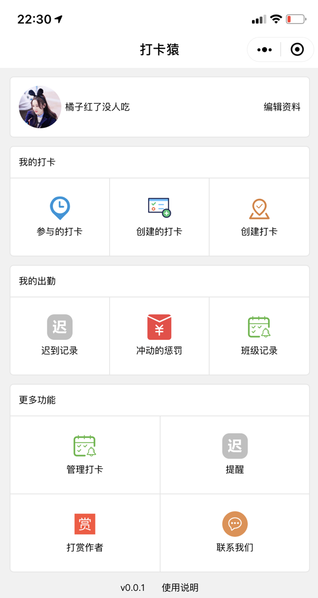
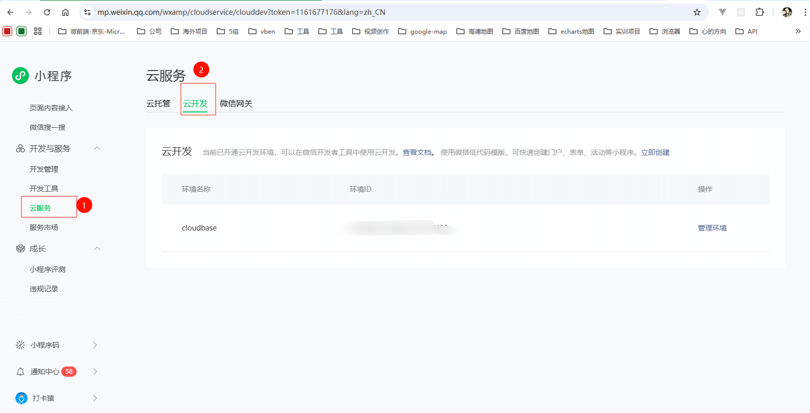
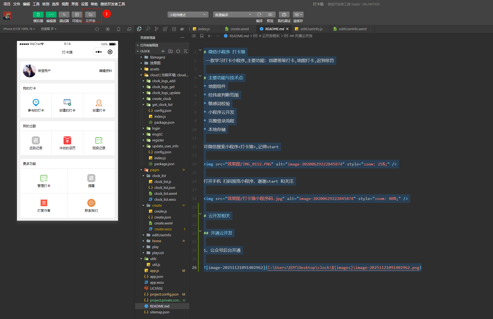
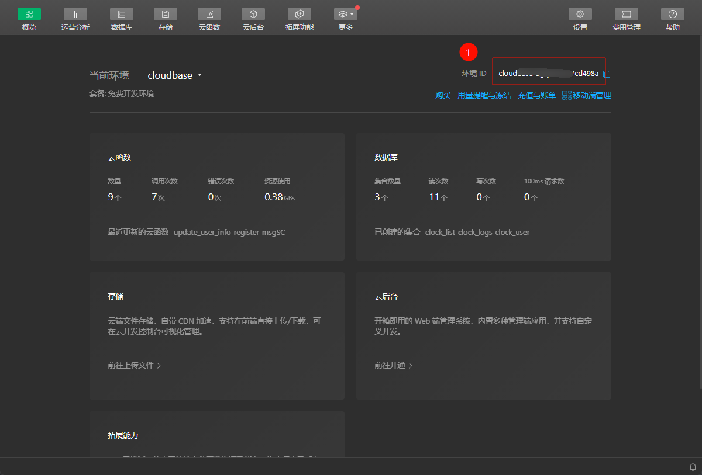
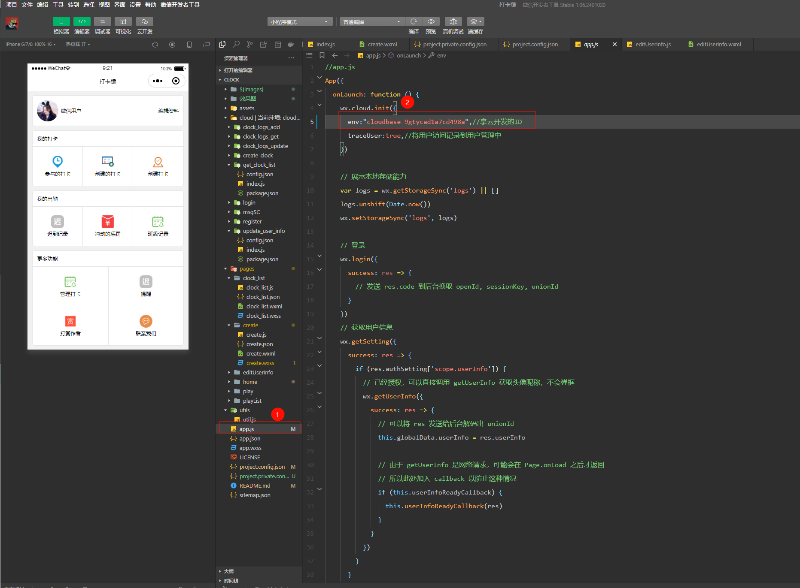
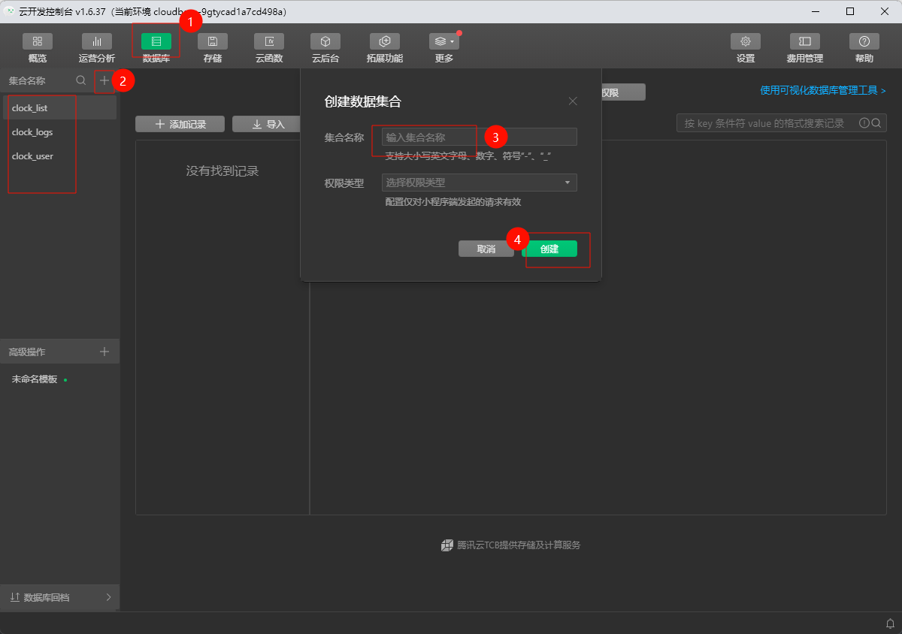
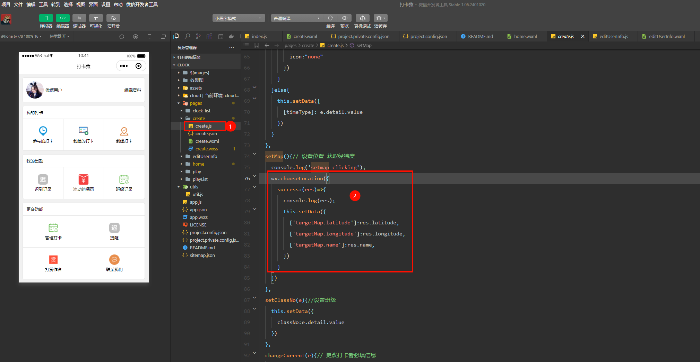
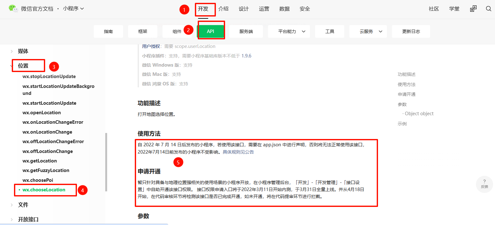

# 微信小程序 打卡猿
一款学习打卡小程序,主要功能：创建班级打卡,地图打卡,迟到惩罚

主要用于小程序开发学习，适用前端学习小程序开发，也可用于毕业设计

# 主要功能与技术点
* 地图组件
* 经纬度判断范围
* 敏感词校验
* 小程序云开发
* 完整登录流程
* 本地存储

<s>可微信搜索小程序<打卡猿>,记得start</s>

由于没有开通微信认证，故不能被搜索和分享，不贵，30元，如有人慷慨解囊，我愿意更新。

所以，朋友们可以扫码

打开手机 **微信扫码预览小程序**，谢谢start 和关注

# 云开发相关

## 开通云开发

云开发只针对于开发期间，1个月左右就需要付费。

### 1、公众号后台开通

### 2、微信开发者工具-查看云开发id并复制

### 3、代码配置云开发id

### 4、数据库创建表

# 代码运行不起来的原因：

### 1、接口限制

由于微信对于获取用户数据的接口进行了限制，需要小程序符合相关行业，例如需要小程序去申请开通地图权限 则需要满足 地图申请的权限，例如外卖类型的小程序 则可以、

早前2021年刚开发这个小程序时是没有这方面限制的，而现在则必须有权限，当然你们可以去申请开通即可！

### 2、获取地图代码位置

### 3、微信小程序官方文档-地图权限说明

